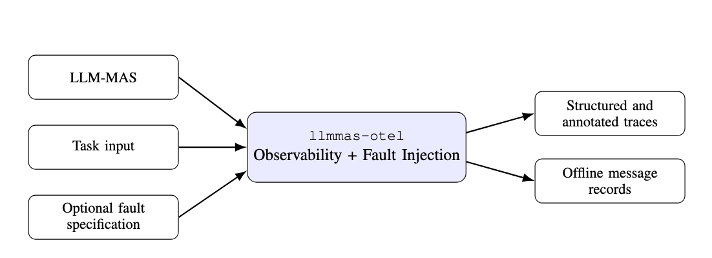

# llmmas-otel

Framework-agnostic OpenTelemetry observability and fault injection for LLM-based multi-agent systems.


`llmmas-otel` helps you instrument an existing Python-based LLM-MAS without rewriting the framework itself. It adds structured tracing for workflow execution and supports controlled fault injection at key boundaries such as agent-to-agent messaging, tool calls, and LLM calls.

The package is especially useful for debugging, execution analysis, reliability experiments, and trace-aligned fault-injection studies in LLM-based multi-agent systems.

## Features

- **Framework-agnostic instrumentation** for existing Python MAS implementations
- **OpenTelemetry-native traces** exportable to any OTLP-compatible backend
- **Structured trace hierarchy** for sessions, workflow phases, agent steps, A2A communication, tool calls, and LLM calls
- **Optional JSONL message store** for full message-body capture during offline analysis
- **Config-driven fault injection** via YAML or JSON
- **Low-overhead defaults** with previews and hashes instead of full payload storage unless explicitly enabled
- **Reusable semantic conventions** for consistent analysis across runs and systems

## What this project is

`llmmas-otel` is an **instrumentation and experimentation layer**.

It does **not** provide a full agent framework, orchestration engine, or benchmark suite. Instead, it is designed to be embedded into an existing LLM-MAS implementation with minimal code changes.

## Trace model

The current trace model is built around the following execution structure:

- **Session**: one end-to-end run
- **Segment / Phase**: a workflow stage within a run
- **Agent step**: one step performed by an agent
- **A2A send**: an outgoing agent-to-agent message
- **A2A receive**: an incoming message processing step
- **Tool call**: a tool execution boundary
- **LLM call**: an LLM inference boundary

In the current API, `phase(...)` is an alias of `segment(...)`.

## Requirements

- Python 3.10+
- `opentelemetry-api`
- `opentelemetry-sdk`
- `opentelemetry-exporter-otlp-proto-grpc`
- `PyYAML`

## Quick start

### 1) Initialize tracing

You can export traces either to the console or to an OTLP-compatible backend such as Jaeger.

```python
from llmmas_otel.bootstrap import init_otlp_tracing

init_otlp_tracing(
    service_name="my-llm-mas",
    endpoint="http://localhost:4317",
    insecure=True,
)
```

For quick local debugging:

```python
from llmmas_otel.bootstrap import init_console_tracing

init_console_tracing(service_name="my-llm-mas")
```

### 2) Instrument your MAS

```python
from llmmas_otel import (
    observe_session,
    observe_agent_step,
    observe_a2a_send,
    observe_a2a_receive,
    observe_tool_call,
    observe_llm_call,
    phase,
    enable_message_store,
)

# Optional: store full messages for offline analysis
enable_message_store("out/messages.jsonl")


@observe_llm_call(
    provider_name="openai",
    model="gpt-4o",
    input_text_fn=lambda prompt: prompt,
    output_text_fn=lambda result: result,
    record_input=True,
    record_output=True,
)
def llm_generate(prompt: str) -> str:
    return f"Generated response for: {prompt}"


@observe_tool_call(
    tool_name="pytest",
    tool_type="cli",
    tool_args_fn=lambda command: command,
    tool_result_fn=lambda result: result,
    record_args=True,
    record_result=True,
)
def run_tool(command: str) -> str:
    return "ok"


@observe_a2a_send(
    source_agent_id="ceo",
    target_agent_id="cto",
    edge_id="ceo->cto",
    message_id="msg-001",
    message_body_fn=lambda message, carrier: message,
    carrier_fn=lambda message, carrier: carrier,
)
def send_message(message: str, carrier: dict[str, str]) -> None:
    pass


@observe_a2a_receive(
    source_agent_id="ceo",
    target_agent_id="cto",
    edge_id="ceo->cto",
    message_id="msg-001",
    message_body_fn=lambda message, carrier: message,
    carrier_fn=lambda message, carrier: carrier,
)
def receive_message(message: str, carrier: dict[str, str]) -> None:
    pass


@observe_agent_step(agent_id="cto", step_index=1)
def cto_step() -> None:
    carrier = {}

    send_message("Design a terminal chess game in Python.", carrier)
    receive_message("Use minimal dependencies.", carrier)

    llm_generate("Plan the implementation.")
    run_tool("pytest -q")


@observe_session(session_id="demo-run-001")
def run() -> None:
    with phase(name="design", order=1, origin="chatdev-like-workflow"):
        cto_step()


if __name__ == "__main__":
    run()
```

## Fault injection

`llmmas-otel` supports config-driven fault injection using YAML or JSON.

### Enable fault injection

```python
from llmmas_otel import enable_fault_injection, disable_fault_injection

enable_fault_injection("faults.yaml", seed="exp-01")
# ...
disable_fault_injection()
```

### Example fault specification

```yaml
faults:
  - id: A2A_DELAY_1
    hook: a2a_send
    selector:
      edge_id: ceo->cto
    action:
      type: a2a.delay
      params:
        delay_ms: 1500
    limits:
      probability: 1.0
      max_times: 1

  - id: TOOL_TIMEOUT_1
    hook: tool_call
    selector:
      tool_name: pytest
    action:
      type: tool.timeout
    limits:
      probability: 0.5
      max_times: 1

  - id: LLM_RATE_LIMIT_1
    hook: llm_call
    selector: {}
    action:
      type: llm.rate_limit
    limits:
      probability: 1.0
      max_times: 1
```

### Supported hooks

- `a2a_send`
- `a2a_receive`
- `tool_call`
- `llm_call`

### Supported fault actions

#### Agent-to-agent faults
- `a2a.drop`
- `a2a.delay`
- `a2a.truncate`

#### Tool faults
- `tool.delay`
- `tool.not_installed`
- `tool.timeout`
- `tool.malformed_response`

#### LLM faults
- `llm.delay`
- `llm.rate_limit`
- `llm.timeout`
- `llm.network_error`
- `llm.malformed_response`

### Supported selector fields

A fault can be scoped using any combination of the following selector fields:

- `phase_name`
- `phase_order`
- `agent_id`
- `step_index`
- `source_agent_id`
- `target_agent_id`
- `edge_id`
- `message_id`
- `channel`
- `tool_name`
- `tool_type`
- `tool_call_id`

Unspecified fields act as wildcards.

## Message store

By default, the library records lightweight previews and hashes in spans. Full message bodies are only written if you explicitly enable the message store.

```python
from llmmas_otel import enable_message_store, disable_message_store

enable_message_store("out/messages.jsonl")
# ...
disable_message_store()
```

Each JSONL record contains execution context such as:

- `session_id`
- `segment`
- `direction`
- `message_id`
- `sha256`
- `body`
- `source_agent_id`
- `target_agent_id`
- `edge_id`
- `channel`

When fault injection is active, message records can also include fault metadata such as fault ID, fault type, decision type, mutation origin, or drop markers.

## Public API

### Instrumentation decorators and context managers

- `observe_session(session_id=...)`
- `observe_segment(name=..., order=..., origin=...)`
- `observe_phase(name=..., order=..., origin=...)`
- `segment(name=..., order=..., origin=...)`
- `phase(name=..., order=..., origin=...)`
- `observe_agent_step(agent_id=..., step_index=...)`
- `observe_a2a_send(...)`
- `observe_a2a_receive(...)`
- `observe_tool_call(...)`
- `observe_llm_call(...)`

### Message store

- `enable_message_store(path)`
- `disable_message_store()`

### Fault injection

- `enable_fault_injection(path, seed="0")`
- `disable_fault_injection()`
- `fault_injection_enabled()`

## Semantic conventions

The package defines a lightweight set of semantic conventions for LLM-MAS tracing, including:

- session identifiers
- workflow segment metadata
- agent identifiers and step indices
- A2A edge metadata
- message previews and hashes
- GenAI operation metadata
- injected fault metadata

This makes traces easier to analyze consistently across runs and backends.

## Project structure

```text
src/
└── llmmas_otel/
    ├── __init__.py
    ├── bootstrap.py
    ├── decorators.py
    ├── span_factory.py
    ├── semconv.py
    ├── message_store.py
    └── injection/
        ├── __init__.py
        ├── api.py
        ├── config.py
        ├── engine.py
        ├── exceptions.py
        ├── loader.py
        ├── matcher.py
        ├── spec.py
        ├── spec_engine.py
        └── types.py
```

## Design goals

- **Minimal integration effort** into existing MAS codebases
- **Trace-first observability** for debugging and execution analysis
- **Reproducible fault injection** for reliability experiments
- **Framework independence** rather than coupling to a single agent framework
- **Research-friendly outputs** suitable for analysis pipelines and evaluation studies

## Current status

This project is currently an early-stage release (`0.0.1`) focused on:

- structured tracing
- optional message capture
- config-based fault injection
- research and debugging workflows

The API may evolve as the project matures.


